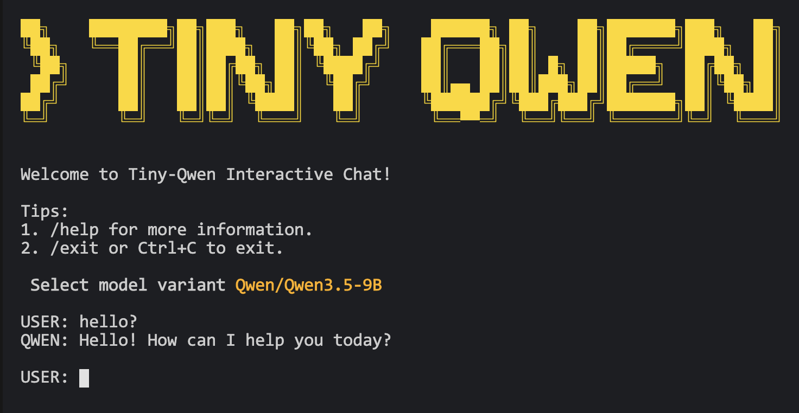

<p align="left">
    English | <a href="README_CN.md">中文</a>
</p>

<p align="center">
    
</p>

## ✨ Tiny Qwen

A minimal, easy-to-read PyTorch re-implementation of `Qwen3.5` vision-language models. Supports text+vision as well as dense and mixture-of-experts variants.

For `Qwen3-VL` implementation, see [this branch](https://github.com/Emericen/tiny-qwen/tree/legacy/qwen3_vl).

For `Qwen3` (text-only) and `Qwen2.5 VL` support, see [this branch](https://github.com/Emericen/tiny-qwen/tree/legacy/qwen2_5).

For `DeepSeek R1`, see [this repo](https://github.com/Emericen/tiny-deepseek-r1).

Join my [Discord channel](https://discord.gg/sBNnqP9gaY) for more discussion!

## 🎇 Quick Start

Create a virtual environment:

```bash
pip install uv 
uv venv
source .venv/bin/activate
uv pip install -r requirements.txt
```

Launch the interactive chat:

```bash
python run.py
```

**Note:** Use `@relative/path/to/image.jpg` to reference images.

## 🧪 Ultimate Side-by-Side Test

Run one script that iterates model variants and prints:
1. Hugging Face Transformers output
2. Tiny-Qwen output

for the same image + prompt context, back-to-back per model.

```bash
python test/run_ultimate_compare.py
```

By default it runs:

- `Qwen/Qwen3.5-0.8B`
- `Qwen/Qwen3.5-2B`
- `Qwen/Qwen3.5-4B`
- `Qwen/Qwen3.5-9B`
- `Qwen/Qwen3.5-27B`
- `Qwen/Qwen3.5-35B-A3B`

Useful flags:

```bash
# subset of models
python test/run_ultimate_compare.py --models Qwen/Qwen3.5-2B Qwen/Qwen3.5-9B

# custom image/prompt/tokens
python test/run_ultimate_compare.py \
  --image-path test/data/test-img-1.jpg \
  --prompt "Describe this image accurately in 2-3 sentences." \
  --max-new-tokens 128 \
  --no-enable-thinking
```

## 📝 Code Examples

Using the `Qwen3_5` class in code:

```python
from PIL import Image
from huggingface_hub import snapshot_download
from model.model import Qwen3_5
from model.processor import Processor

image = Image.open("test/data/test-img-1.jpg")

messages = [
    {
        "role": "user",
        "content": [
            {"type": "image", "image": image},
            {"type": "text", "text": "What's on this image?"},
        ],
    },
]

model_name = "Qwen/Qwen3.5-27B"
weights = snapshot_download(repo_id=model_name, cache_dir=".cache")
model = Qwen3_5.from_pretrained(weights_path=weights, device_map="auto")
processor = Processor.from_pretrained(model_name)

device = next(model.parameters()).device
inputs = processor(messages, add_generation_prompt=True, device=device)

output_ids = model.generate(**inputs, max_new_tokens=64)
print(processor.tokenizer.decode(output_ids[0].tolist()))

print("Streaming output:", end=" ", flush=True)
for token_id in model.generate_stream(**inputs, max_new_tokens=64):
    print(processor.tokenizer.decode([token_id]), end="", flush=True)
print()
```
